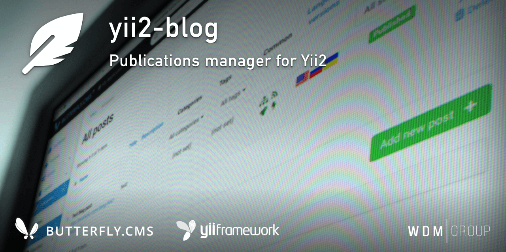

# Yii2 Blog
Publications manager for Yii2.

The module have multilanguage support and integration with Sitemaps, RSS-feeds, Google AMP and Yandex.Turbo modules.

This module is an integral part of the [Butterfly.СMS](https://butterflycms.com/) content management system, but can also be used as an standalone extension.

Copyrights (c) 2019-2021 [W.D.M.Group, Ukraine](https://wdmg.com.ua/)

# Requirements 
* PHP 5.6 or higher
* Yii2 v.2.0.40 and newest
* [Yii2 Base](https://github.com/wdmg/yii2-base) module (required)
* [Yii2 Translations](https://github.com/wdmg/yii2-translations) module (optionaly)
* [Yii2 Editor](https://github.com/wdmg/yii2-editor) widget
* [Yii2 SelectInput](https://github.com/wdmg/yii2-selectinput)
* [Yii2 TagsInput](https://github.com/wdmg/yii2-tagsinput) widget

# Installation
To install the module, run the following command in the console:

`$ composer require "wdmg/yii2-blog"`

After configure db connection, run the following command in the console:

`$ php yii blog/init`

And select the operation you want to perform:
  1) Apply all module migrations
  2) Revert all module migrations

# Migrations
In any case, you can execute the migration and create the initial data, run the following command in the console:

`$ php yii migrate --migrationPath=@vendor/wdmg/yii2-blog/migrations`

# Configure
To add a module to the project, add the following data in your configuration file:

    'modules' => [
        ...
        'blog' => [
            'class' => 'wdmg\blog\Module',
            'routePrefix' => 'admin',
            'baseRoute'  => '/blog', // route for frontend (string or array), use "/" - for root
            'baseLayout' => '@app/views/layouts/main', // the default layout to render blog
            'imagePath' => '/uploads/blog' // the default path to save blog thumbnails in @webroot
        ],
        ...
    ],

# Routing
Use the `Module::dashboardNavItems()` method of the module to generate a navigation items list for NavBar, like this:

    <?php
        echo Nav::widget([
        'options' => ['class' => 'navbar-nav navbar-right'],
            'label' => 'Modules',
            'items' => [
                Yii::$app->getModule('blog')->dashboardNavItems(),
                ...
            ]
        ]);
    ?>

# Status and version [ready to use]
* v.1.2.4 - RBAC implementation
* v.1.2.3 - URL redirect notify, defaultController property, update dependencies and README.md
* v.1.2.2 - Fixed JsonValidator in dependencies
* v.1.2.1 - Added AliasInput::widget()
* v.1.2.0 - Multi-language support
* v.1.1.4 - Log activity
* v.1.1.3 - Added pagination
* v.1.1.2 - Added default sort and fix breadcrumbs
* v.1.1.1 - Filter posts by categories and tags (view dashboard)
* v.1.1.0 - Added CRUD for taxonomy (Categories, Tags)
* v.1.0.1 - Added migrations, CRUD and models for Categories, Tags